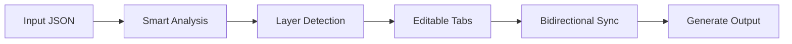

# 🚀 Super JSON Editor

<div align="center">


**The Ultimate Multi-Layer Escaped JSON Editor - Parse, Edit, and Rebuild Complex Nested JSON with Ease! 🎯**

[Live Demo](https://your-username.github.io/super-json) | [Report Bug](https://github.com/your-username/super-json/issues) | [Request Feature](https://github.com/your-username/super-json/issues)

</div>

---

## ✨ What Makes It Super?

Ever struggled with deeply nested, escaped JSON strings? Like this nightmare:

```json
{
  "level1": "{\"level2\": \"{\\\"level3\\\": \\\"data\\\"}\"}"
}
```

**Super JSON Editor** makes it beautiful and editable! 🎨

<div align="center">
  
</div>

## 🔥 Features That Will Blow Your Mind

### 🎯 Core Features
- **🔍 Smart Analysis** - Automatically detects and parses infinite layers of escaped JSON
- **📑 Multi-Tab Editing** - Work on multiple JSON documents simultaneously
- **🔄 Bidirectional Sync** - Changes in any layer automatically sync across all related layers
- **💾 Auto-Save** - Never lose your work with browser localStorage persistence
- **🎨 Beautiful UI** - Monaco Editor (VS Code's editor) with syntax highlighting

### 🚀 Advanced Features
- **📊 Layer Visualization** - See all JSON layers at a glance
- **✂️ Smart Parsing** - Handles complex nested structures that other tools can't
- **🔧 Real-time Validation** - Instant JSON validation as you type
- **📱 Responsive Design** - Works perfectly on all screen sizes
- **⌨️ Keyboard Shortcuts** - Power user? We've got you covered!

## 🎮 Quick Start

### Online Version (Recommended)
Just open [https://your-username.github.io/super-json](https://your-username.github.io/super-json) - No installation needed! 🎉

### Local Setup
```bash
# Clone the repository
git clone https://github.com/your-username/super-json.git

# Navigate to the directory
cd super-json

# Open in browser
open index.html
# or
python -m http.server 8000
# then visit http://localhost:8000
```

## 🎯 Use Cases

Perfect for:
- 🔧 **API Development** - Debug complex API responses
- 🗄️ **Database Management** - Edit JSON columns with nested data
- 📊 **Data Processing** - Clean and transform multi-layer JSON
- 🔍 **Debugging** - Understand complex JSON structures
- 📝 **Configuration Files** - Manage nested config files

## ⌨️ Keyboard Shortcuts

| Shortcut | Action |
|----------|--------|
| `Ctrl+Enter` | Analyze JSON |
| `Ctrl+S` | Generate Output |
| `Ctrl+T` | New Document |
| `Ctrl+W` | Close Document |
| `Ctrl+Tab` | Switch Documents |

## 🏗️ How It Works



1. **Paste** your complex JSON into the input panel
2. **Click** "智能分析" to parse all layers
3. **Edit** any layer in the tabbed interface
4. **Generate** the final output with all changes applied

## 🌟 Why Developers Love It

> "Finally, a tool that understands my pain with escaped JSON!" - **Developer**

> "This saved me hours of manual parsing!" - **Backend Engineer**

> "The bidirectional sync is pure magic!" - **Full Stack Developer**

## 🛠️ Tech Stack

- **Pure JavaScript** - No build process, no dependencies
- **Monaco Editor** - The power of VS Code in your browser
- **LocalStorage API** - Persistent storage without servers
- **Modern CSS3** - Beautiful, responsive design

## 📦 Features Roadmap

- [ ] JSON Schema validation
- [ ] Export/Import functionality
- [ ] Dark/Light theme toggle
- [ ] Collaborative editing
- [ ] API integration
- [ ] JSON diff viewer

## 🤝 Contributing

Contributions are what make the open source community amazing! Any contributions you make are **greatly appreciated**.

1. Fork the Project
2. Create your Feature Branch (`git checkout -b feature/AmazingFeature`)
3. Commit your Changes (`git commit -m 'Add some AmazingFeature'`)
4. Push to the Branch (`git push origin feature/AmazingFeature`)
5. Open a Pull Request

## 📄 License

Distributed under the MIT License. See `LICENSE` for more information.

## 🙏 Acknowledgments

- Monaco Editor by Microsoft
- Inspired by the pain of debugging nested JSON
- Built with ❤️ for developers by developers

---

<div align="center">

### 🌟 Star us on GitHub!

If this tool saved you time, please consider giving it a star! ⭐

**[Star This Repo](https://github.com/your-username/super-json)**

Made with ❤️ by developers who hate escaped JSON as much as you do!

</div>