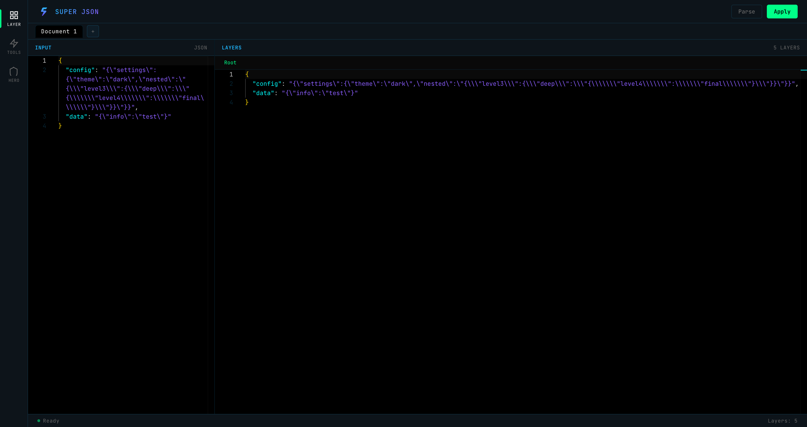
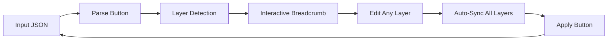

# 🚀 Super JSON Editor

<div align="center">


**The Ultimate Multi-Layer Escaped JSON Editor - Parse, Edit, and Rebuild Complex Nested JSON with Ease! 🎯**

[Live Demo](https://hrhrng.github.io/super-json) | [Report Bug](https://github.com/hrhrng/super-json/issues) | [Request Feature](https://github.com/hrhrng/super-json/issues)

</div>

---

## ✨ What Makes It Super?

Ever struggled with deeply nested, escaped JSON strings? Like this nightmare:

```json
{
  "config": "{\"settings\":{\"theme\":\"dark\",\"nested\":\"{\\\"level3\\\":{\\\"deep\\\":\\\"{\\\\\\\"level4\\\\\\\":\\\\\\\"final\\\\\\\"}\\\"}}\"}}"
}
```

**Super JSON Editor** transforms it into beautiful, editable layers! 🎨

<div align="center">
  
  <p><em>Clean and intuitive interface with multi-layer JSON parsing</em></p>
</div>

### 📸 See It In Action

<div align="center">
  
  <p><em>Navigate through complex nested JSON layers with ease</em></p>
</div>

## 🔥 Features That Will Blow Your Mind

### 🎯 Three Powerful Modes

#### 🔍 **LAYER Mode** - Multi-Layer JSON Editor
- **Smart Analysis** - Automatically detects and parses infinite layers of escaped JSON
- **Interactive Breadcrumb** - Navigate through JSON layers with visual hierarchy
- **Bidirectional Sync** - Changes in any layer automatically sync across parent/child layers
- **Real-time Validation** - Instant JSON validation with error notifications
- **Multi-Document Tabs** - Work on multiple JSON documents simultaneously

#### 🔧 **TOOLS Mode** - JSON Processor
- **Format & Minify** - Beautiful formatting or compact minification
- **Escape & Unescape** - Handle escaped JSON strings with ease
- **Base64 Encode/Decode** - Convert JSON to/from Base64
- **URL Encode/Decode** - Make JSON URL-safe
- **Sort Keys** - Alphabetically sort all object keys
- **Apply to Input** - Instantly apply processed output back to input

#### 🦸 **HERO Mode** - Visual JSON Explorer
- **JSON Hero Integration** - Visualize JSON structure with JSON Hero
- **Interactive Preview** - Explore your JSON in a beautiful interface
- **Share & Collaborate** - Generate shareable links for your JSON
- **Open in New Tab** - Full JSON Hero experience in a new window

## 🎮 Quick Start

### Online Version (Recommended)
Just open [https://hrhrng.github.io/super-json](https://hrhrng.github.io/super-json) - No installation needed! 🎉

### Local Setup
```bash
# Clone the repository
git clone https://github.com/hrhrng/super-json.git

# Navigate to the directory
cd super-json

# Install dependencies
npm install

# Start development server
npm run dev
# then visit http://localhost:3000/super-json/

# Or build for production
npm run build
npm run preview
```

## 🎯 Use Cases

Perfect for:
- 🔧 **API Development** - Debug complex API responses
- 🗄️ **Database Management** - Edit JSON columns with nested data
- 📊 **Data Processing** - Clean and transform multi-layer JSON
- 🔍 **Debugging** - Understand complex JSON structures
- 📝 **Configuration Files** - Manage nested config files

## 🏗️ How It Works

### LAYER Mode Workflow


1. **Paste** your nested/escaped JSON into the input panel
2. **Click** "Parse" to analyze and detect all layers
3. **Navigate** through layers using the interactive breadcrumb
4. **Edit** any layer - changes auto-sync to related layers
5. **Click** "Apply" to update the input with your changes

### TOOLS Mode Workflow
1. **Input** your JSON in the left panel
2. **Select** any processing tool (Format, Escape, Base64, etc.)
3. **View** the processed result in the output panel
4. **Apply** the result back to input if needed

### HERO Mode Workflow
1. **Input** your JSON data
2. **Load** into the embedded JSON Hero viewer
3. **Explore** your data structure visually
4. **Open** in new tab for full experience

## 🌟 Why Developers Love It

> "Finally, a tool that understands my pain with escaped JSON!" - **Developer**

> "This saved me hours of manual parsing!" - **Backend Engineer**

> "The bidirectional sync is pure magic!" - **Full Stack Developer**

## 🛠️ Tech Stack

- **React 18** - Modern reactive UI framework
- **TypeScript** - Type-safe development
- **Monaco Editor** - VS Code's powerful editor in your browser
- **Zustand** - Lightweight state management
- **Vite** - Lightning-fast build tool
- **LocalStorage API** - Persistent storage without servers
- **JSON Hero API** - Visual JSON exploration

## 🌟 Key Features

- ✅ **Multi-layer JSON parsing** - Handle infinite nested escaped JSON
- ✅ **Three specialized modes** - Layer editing, processing tools, visual exploration
- ✅ **Multi-document support** - Work with multiple JSONs simultaneously
- ✅ **Auto-save** - Never lose your work
- ✅ **Real-time validation** - Instant error feedback
- ✅ **Bidirectional sync** - Smart parent-child layer synchronization
- ✅ **JSON processing tools** - Format, escape, encode, sort, and more
- ✅ **JSON Hero integration** - Beautiful visualization
- ✅ **Modern dark theme** - Neon-styled interface
- ✅ **Responsive design** - Works on all devices

## 🤝 Contributing

Contributions are what make the open source community amazing! Any contributions you make are **greatly appreciated**.

1. Fork the Project
2. Create your Feature Branch (`git checkout -b feature/AmazingFeature`)
3. Commit your Changes (`git commit -m 'Add some AmazingFeature'`)
4. Push to the Branch (`git push origin feature/AmazingFeature`)
5. Open a Pull Request

## 📄 License

Distributed under the MIT License. See `LICENSE` for more information.

## 🙏 Acknowledgments

- Monaco Editor by Microsoft
- Inspired by the pain of debugging nested JSON
- Built with ❤️ for developers by developers

---

<div align="center">

### 🌟 Star us on GitHub!

If this tool saved you time, please consider giving it a star! ⭐

**[Star This Repo](https://github.com/hrhrng/super-json)**

Made with ❤️ by developers who hate escaped JSON as much as you do!

</div>