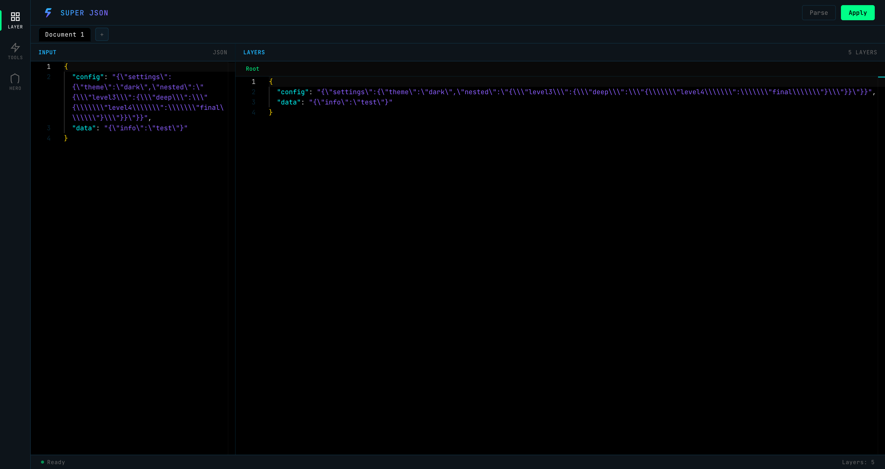
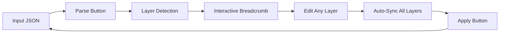

# 🚀 Super JSON Editor

<div align="center">


**The Ultimate Multi-Layer Escaped JSON Editor - Parse, Edit, and Rebuild Complex Nested JSON with Ease! 🎯**

[**Try It Now**](https://hrhrng.github.io/super-json)

[Report Bug](https://github.com/hrhrng/super-json/issues) | [Request Feature](https://github.com/hrhrng/super-json/issues)

</div>

---

## ✨ What Makes It Super?

Ever struggled with deeply nested, escaped JSON strings? Like this nightmare:

```json
{
  "config": "{\"settings\":{\"theme\":\"dark\",\"nested\":\"{\\\"level3\\\":{\\\"deep\\\":\\\"{\\\\\\\"level4\\\\\\\":\\\\\\\"final\\\\\\\"}\\\"}}\"}}"
}
```

**Super JSON Editor** transforms it into beautiful, editable layers! 🎨

<div align="center">
  
  <p><em>Clean and intuitive interface with multi-layer JSON parsing</em></p>
</div>

### 📸 See It In Action

<div align="center">
  
  <p><em>Navigate through complex nested JSON layers with ease</em></p>
</div>

## 🔥 Features

### 🎯 Four Powerful Modes

#### 🔍 **LAYER Mode** - Multi-Layer JSON Editor
- **Smart Analysis** - Automatically detects and parses up to 10 layers of escaped JSON
- **Interactive Breadcrumb** - Navigate through JSON layers with visual hierarchy
- **Bidirectional Sync** - Changes in any layer automatically sync across parent/child layers
- **Real-time Validation** - Instant JSON validation with error notifications
- **Multi-Document Tabs** - Work on multiple JSON documents simultaneously

#### 🔧 **TOOLS Mode** - JSON Processor
- **Format & Minify** - Beautiful formatting or compact minification (with best-effort fallback for invalid JSON)
- **Escape & Unescape** - Handle escaped JSON strings with ease
- **Base64 Encode/Decode** - Convert JSON to/from Base64
- **URL Encode/Decode** - Make JSON URL-safe
- **Sort Keys** - Alphabetically sort all object keys
- **Case Conversion** - camelCase ↔ snake_case key conversion
- **Apply to Input** - Instantly apply processed output back to input

#### 🦸 **HERO Mode** - Visual JSON Explorer
- **JSON Hero Integration** - Visualize JSON structure with JSON Hero
- **Interactive Preview** - Explore your JSON in a beautiful interface
- **Share & Collaborate** - Generate shareable links for your JSON
- **Open in New Tab** - Full JSON Hero experience in a new window

#### 📊 **DIFF Mode** - JSON Comparison
- **Side-by-Side Diff** - Compare two JSON documents with Monaco DiffEditor
- **Document Selector** - Pick any open document to compare against
- **Toggle Unchanged** - Show or hide unchanged regions

### 🔗 Share & Import

Share JSON instantly via URL — no server required:

- **Share Button** - One-click share with LZ-String compression (`?s=` parameter)
- **Custom Tab Names** - Hover "Share" to name your tab before sharing (`?t=` parameter)
- **Base64url Mode** - Shell-friendly encoding without dependencies (`?r=` parameter)
- **Hero Direct Link** - Add `?h=1` to auto-open JSON Hero viewer on import

### 🤖 Claude Code Skill: `present-json`

The `skills/present-json/` directory contains a first-class [Claude Code skill](https://docs.anthropic.com/en/docs/claude-code) that lets AI agents present JSON results to humans via interactive browser links.

```bash
# Agent generates a shareable link from any JSON
encoded=$(echo -n '{"status":"ok","data":[1,2,3]}' | base64 | tr '+/' '-_' | tr -d '=\n')
echo "https://hrhrng.github.io/super-json?r=${encoded}&t=API+Response"

# With Hero mode for interactive visualization
echo "https://hrhrng.github.io/super-json?r=${encoded}&t=API+Response&h=1"
```

**URL Parameters:**

| Param | Description | Example |
|-------|-------------|---------|
| `s` | LZ-String compressed JSON (shorter URLs) | `?s=NoIgbg9...` |
| `r` | Base64url encoded JSON (shell-friendly) | `?r=eyJrZXki...` |
| `t` | Custom tab name | `&t=My+Results` |
| `h` | Auto-switch to Hero mode | `&h=1` |

## 🎮 Quick Start

### Online Version (Recommended)
Just open [https://hrhrng.github.io/super-json](https://hrhrng.github.io/super-json) - No installation needed! 🎉

### Local Setup
```bash
# Clone the repository
git clone https://github.com/hrhrng/super-json.git

# Navigate to the directory
cd super-json

# Install dependencies
npm install

# Start development server
npm run dev
# then visit http://localhost:3000/super-json/

# Or build for production
npm run build
npm run preview
```

## 🎯 Use Cases

Perfect for:
- 🔧 **API Development** - Debug complex API responses
- 🗄️ **Database Management** - Edit JSON columns with nested data
- 📊 **Data Processing** - Clean and transform multi-layer JSON
- 🔍 **Debugging** - Understand complex JSON structures
- 📝 **Configuration Files** - Manage nested config files
- 🤖 **AI Agent Output** - Agents share JSON results via `present-json` skill for human review

## 🏗️ How It Works

### LAYER Mode Workflow

```mermaid
graph LR
    A[Input JSON] --> B[Parse Button]
    B --> C[Layer Detection]
    C --> D[Interactive Breadcrumb]
    D --> E[Edit Any Layer]
    E --> F[Auto-Sync All Layers]
    F --> G[Apply Button]
    G --> A
```

1. **Paste** your nested/escaped JSON into the input panel
2. **Click** "Parse" to analyze and detect all layers
3. **Navigate** through layers using the interactive breadcrumb
4. **Edit** any layer - changes auto-sync to related layers
5. **Click** "Apply" to update the input with your changes

### TOOLS Mode Workflow
1. **Input** your JSON in the left panel
2. **Select** any processing tool (Format, Escape, Base64, etc.)
3. **View** the processed result in the output panel
4. **Apply** the result back to input if needed

### HERO Mode Workflow
1. **Input** your JSON data
2. **Load** into the embedded JSON Hero viewer
3. **Explore** your data structure visually
4. **Open** in new tab for full experience

## 🛠️ Tech Stack

- **React 18** - Modern reactive UI framework
- **TypeScript** - Type-safe development with strict mode
- **Monaco Editor** - VS Code's powerful editor in your browser
- **Zustand** - Lightweight state management with Immer middleware
- **Vite** - Lightning-fast build tool
- **LZ-String** - URL-safe JSON compression for sharing
- **Playwright** - E2E snapshot testing
- **Vitest** - Unit testing
- **LocalStorage API** - Persistent storage without servers
- **JSON Hero API** - Visual JSON exploration
- **GitHub Actions** - CI/CD with preview deployments

## 📁 Project Structure

```
super-json/
├── src/
│   ├── components/
│   │   ├── Layout/
│   │   │   ├── MainLayout.tsx          # Core layout with mode routing
│   │   │   ├── components/             # DocumentTabs, ViewModeButtons
│   │   │   └── modes/                  # LayerMode, ProcessorMode, HeroMode, DiffMode
│   │   ├── Breadcrumb/                 # Layer navigation breadcrumb
│   │   ├── Notification/               # Toast notification system
│   │   └── ShareButton/                # Share link generator with dropdown
│   ├── hooks/
│   │   ├── useKeyboardShortcuts.ts     # Ctrl+Enter, Ctrl+S, Ctrl+T, etc.
│   │   └── useSimpleImport.ts          # URL parameter import (s, r, t, h)
│   ├── stores/
│   │   ├── documentStore.ts            # Document state (Zustand + Immer)
│   │   └── appStore.ts                 # App settings state
│   ├── utils/
│   │   ├── jsonAnalyzer.ts             # Core layer detection engine
│   │   ├── jsonFormatter.ts            # Format/minify with best-effort fallback
│   │   ├── jsonDiff.ts                 # Deep diff comparison
│   │   ├── simpleShare.ts              # URL sharing (LZ-String + base64url)
│   │   └── monacoTheme.ts             # Custom neon dark theme
│   └── types/index.ts                  # TypeScript interfaces
├── skills/
│   └── present-json/SKILL.md           # Claude Code skill for agent → human JSON sharing
├── tests/                              # Playwright E2E tests
├── .github/workflows/                  # CI, deploy, preview cleanup
└── index.html                          # Entry point (preview branch title detection)
```

## ⌨️ Keyboard Shortcuts

| Shortcut | Action |
|----------|--------|
| `Ctrl+Enter` | Analyze/Parse JSON |
| `Ctrl+S` | Generate Output |
| `Ctrl+T` | New Document |
| `Ctrl+W` | Close Current Document |
| `Ctrl+Tab` | Switch to Next Document |

## 🌟 Key Features

- ✅ **Multi-layer JSON parsing** - Handle up to 10 layers of nested escaped JSON
- ✅ **Four specialized modes** - Layer editing, processing tools, visual exploration, diff comparison
- ✅ **Multi-document support** - Work with multiple JSONs simultaneously
- ✅ **Shareable links** - Compress and share JSON via URL (LZ-String or base64url)
- ✅ **Claude Code skill** - AI agents can present JSON to humans interactively
- ✅ **Auto-save** - Never lose your work (localStorage persistence)
- ✅ **Real-time validation** - Instant error feedback
- ✅ **Bidirectional sync** - Smart parent-child layer synchronization
- ✅ **JSON processing tools** - Format, minify, escape, encode, sort, case-convert
- ✅ **JSON Hero integration** - Beautiful interactive visualization
- ✅ **Preview deployments** - Branch preview URLs with title indicator
- ✅ **Modern dark theme** - Neon-styled interface with custom Monaco theme
- ✅ **Responsive design** - Works on all devices

## 🤝 Contributing

Contributions are what make the open source community amazing! Any contributions you make are **greatly appreciated**.

1. Fork the Project
2. Create your Feature Branch (`git checkout -b feature/AmazingFeature`)
3. Commit your Changes (`git commit -m 'Add some AmazingFeature'`)
4. Push to the Branch (`git push origin feature/AmazingFeature`)
5. Open a Pull Request

Preview deployments are automatically created for each branch at:
`https://hrhrng.github.io/super-json/preview/<branch-name>/`

## 📄 License

Distributed under the MIT License. See `LICENSE` for more information.

## 🙏 Acknowledgments

- Monaco Editor by Microsoft
- JSON Hero for interactive JSON visualization
- LZ-String for URL-safe compression
- Inspired by the pain of debugging nested JSON
- Built with ❤️ for developers by developers

---

<div align="center">

### 🌟 Star us on GitHub!

If this tool saved you time, please consider giving it a star! ⭐

**[Star This Repo](https://github.com/hrhrng/super-json)**

Made with ❤️ by developers who hate escaped JSON as much as you do!

</div>
